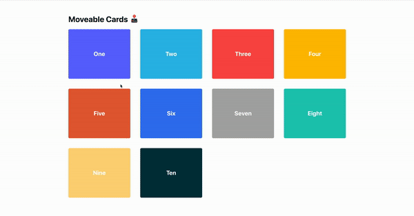

<h1 align="center">
  react-draggable-list
  <br>
  <br>
  📱🕹
</h1>
<p align="center" style="font-size: 1.5rem;">
  A React hook to update the order of lists by dragging items around.
</p>

## About

This project is inspired by the MacOS Launchpad iOS Springboard UI, where items can be dragged
around and reordered.

<p align="center">

</p>

## Setup

```
yarn install
```

```
yarn start
```

## Usage

```
const initialItems = [
  { id: 0, text: 'One', color: '#616AFF' },
  { id: 1, text: 'Two', color: '#2DBAE7' },
  { id: 2, text: 'Three', color: '#fd4e4e' },
]

export default function App() {

  const { items, getItemProps } = useMoveableCards({
    initialItems,
    delay: 200,
    debounceMs: 200,
    easeFunction: `ease-out`
  })

  return (
    <ul>
      {items.map((item: any) => (
        <li key={item.id}>
          <button
            {...getItemProps(item.id)}
            style={{ background: item.color }}
          >
            <span>{item.text}</span>
          </button>
        </li>
      ))}
    </ul>
  )
}
```

## Props

### initialItems

> Array of objects with each item containing a unique id

### delay

> number, defaults to 250

### debounceMs

> number, defaults to 200

### easeFunction

> string, defaults to a subtle springy `cubic-bezier(.39,.28,.13,1.14)`
